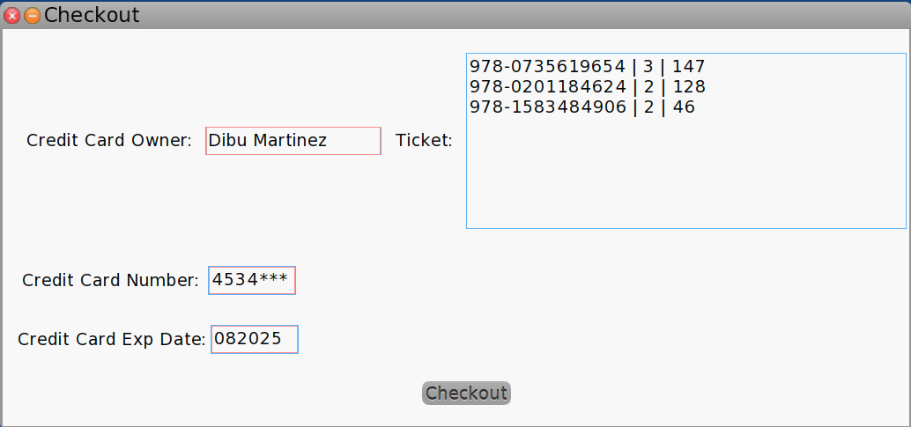

# Tus Libros Server
La solucion está compuesta por un servidor de aplicaciones.

El mismo se levanta ejecutando;

- Start: 
```
StoreServer listenOn: 8080
```

Para bajar el servicio simplemente hay que ejecutar;
- Destroy: 
```
StoreServer allInstances do: [:aServer | aServer destroy.] 
```

# GUI

Para abrir la GUI se debe ejectuar 
```
TusLibrosLogin open.
```

Loguearse con el user: **crazyCashier** y pass: **caraBonita**.


Una vez logueado se abre la ventana de donde se puede;
- agregar libros al carrito; a medida que se agregan aparecen en el **cart**
- hacer el checkout del carrito.
- Listar las compras realizadas.


Cuando se hace un checkout exitos se muestra el ticket como se ve en la figura;



Se pueden listar las purchases

# Tus Libros Server API


### Crate Cart

- http://localhost:8080/createCart?user=crazyCashier&pass=caraBonita

### Add To Cart

- http://localhost:8080/addToCart?cartID=1&bookISBN=978-0735619654&bookQuantity=2
- http://localhost:8080/addToCart?cartID=1&bookISBN=978-1583484906&bookQuantity=3
- http://localhost:8080/addToCart?cartID=1&bookISBN=978-0134769042&bookQuantity=3
- http://localhost:8080/addToCart?cartID=1&bookISBN=978-0201633610&bookQuantity=3
- http://localhost:8080/addToCart?cartID=1&bookISBN=978-0201184624&bookQuantity=3
- http://localhost:8080/addToCart?cartID=1&bookISBN=978-0131177055&bookQuantity=3

### List Cart

- http://localhost:8080/listCart?cartID=1

```json 
Response:
[
  {
    "ISBN": "978-0134769042",
    "Qty": 3
  },
  {
    "ISBN": "978-0201184624",
    "Qty": 3
  },
  {
    "ISBN": "978-0201633610",
    "Qty": 3
  },
  {
    "ISBN": "978-0735619654",
    "Qty": 2
  }
]
```

### Checkout

- http://localhost:8080/checkout?cartID=1&ccn=3232&cced=022021&cco=mycard
```json
Response:
{
  "items": [
    {
      "ISBN": "978-0134769042",
      "quantity": 3,
      "total": 198
    },
    {
      "ISBN": "978-0735619654",
      "quantity": 2,
      "total": 98
    },
    {
      "ISBN": "978-0201184624",
      "quantity": 3,
      "total": 192
    },
    {
      "ISBN": "978-0201633610",
      "quantity": 3,
      "total": 144
    }
  ],
  "total": 632
}
```

### List Purchases

- http://localhost:8080/listPurchases?user=crazyCashier&pass=caraBonita

```json
response
{
  "978-0134769042": 198,
  "978-0201184624": 320,
  "978-0201633610": 144,
  "978-0735619654": 245,
  "978-1583484906": 46
}
```

### List Catalog

- http://localhost:8080/listcatalog?user=crazyCashier&pass=caraBonita

```json
response
[
  {
    "Book": {
      "price": 66,
      "title": "Smalltalk Best Practice Patterns"
    },
    "ISBN": "978-0134769042"
  },
  {
    "Book": {
      "price": 23,
      "title": "Smalltalk, Objects, and Design"
    },
    "ISBN": "978-1583484906"
  },
  {
    "Book": {
      "price": 49,
      "title": "Object thinking"
    },
    "ISBN": "978-0735619654"
  },
  {
    "Book": {
      "price": 50,
      "title": "Working Effectively with Legacy Code"
    },
    "ISBN": "978-0131177055"
  },
  {
    "Book": {
      "price": 64,
      "title": "The Design Patterns Smalltalk Companion"
    },
    "ISBN": "978-0201184624"
  },
  {
    "Book": {
      "price": 48,
      "title": "Design Patterns: Elements of Reusable OO"
    },
    "ISBN": "978-0201633610"
  }
]
```

### _TODO:_

- Faltan validaciones de inputs.
- Faltan simular el Merchant Processor con los distintos errores, tenemos un MerchantProcessor Dummy.
- Falta mostrar en el ticket el nombre de los books.
- Falta mostrar en el cart el nombre de los books.
- Falta el susseccfulWindows cuando se pudo realizar el checkout.
